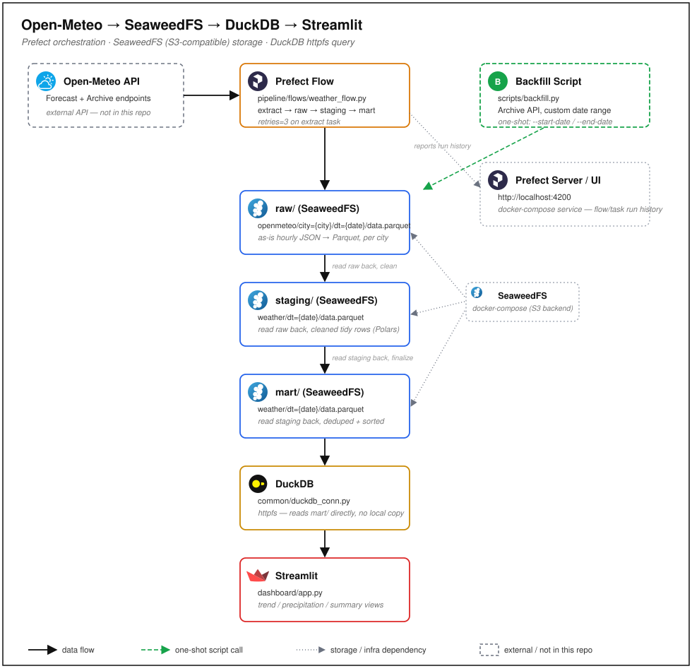

# prefect-seaweedfs-duckdb

End-to-end weather analytics pipeline built for portfolio purposes: it orchestrates daily and historical ingestion of weather data from the free [Open-Meteo](https://open-meteo.com/) API using **Prefect**, lands it through a **raw → staging → mart** layered structure on **SeaweedFS** (self-hosted, S3-compatible object storage), queries the final layer directly with **DuckDB**'s `httpfs` (no local copy of the data), and visualizes multi-city trends in a **Streamlit** dashboard.

## Architecture



Storage layout:
```
s3://weather-bucket/
├── raw/openmeteo/city=<city>/dt=YYYY-MM-DD/data.parquet
├── staging/weather/dt=YYYY-MM-DD/data.parquet
└── mart/weather/dt=YYYY-MM-DD/data.parquet
```

## Setup

1. Copy `.env.example` to `.env` and fill in values (defaults work for the local SeaweedFS compose stack).
2. `docker compose up -d --build` — brings up SeaweedFS (master, volume, filer, s3 gateway on `:8333`), the Prefect server/UI (`:4200`), builds the `app` image, creates the bucket (`bucket-init`, idempotent), registers deployments (`deployments` service, see below), then starts the Streamlit dashboard on `:8501`.

## Running the daily flow

```
docker compose run --rm app python -m pipeline.flows.weather_flow
```

Runs the Prefect flow directly for yesterday's date (forecast API), with retries on the extract step — bypasses the UI/deployment, useful for local debugging.

## Running the backfill (historical load)

```
docker compose run --rm app python -m scripts.backfill --start-date 2024-01-01 --end-date 2024-01-31
```

Lightweight CLI backfill (no Prefect task overhead): loops over `CITIES` × `[--start-date, --end-date]` (both required), pulling from the Open-Meteo Archive API and writing through `raw/` → `staging/` → `mart/`. For the same backfill with full Prefect task tracking/retries, trigger the `weather-backfill` deployment instead.

## Prefect UI

Available at [http://localhost:4200](http://localhost:4200) — trigger and schedule deployments, and see flow runs, task runs, logs, and state history for every run (backed by a persistent `prefect-server` service, not the ephemeral local server Prefect falls back to when no server is configured).

## Dashboard

Already running at [http://localhost:8501](http://localhost:8501) once `docker compose up -d --build` finishes. Shows temperature trend by city, precipitation comparison by city, and summary stats — all queried live from `mart/` via DuckDB's `httpfs`.

## Tests

1. Create and activate a virtual environment:
   ```
   python -m venv .venv
   .venv\Scripts\Activate.ps1
   ```
2. Install dependencies:
   ```
   pip install -r requirements.txt
   ```
3. Run the tests:
   ```
   pytest
   ```

Unit tests cover `extract`, `transform`, and `storage`, with the API/S3 calls mocked.
